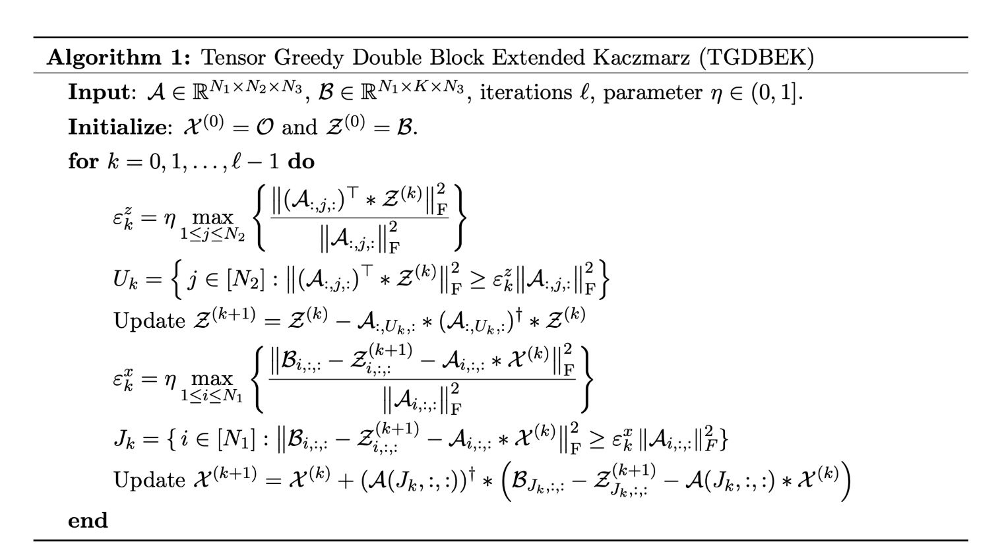
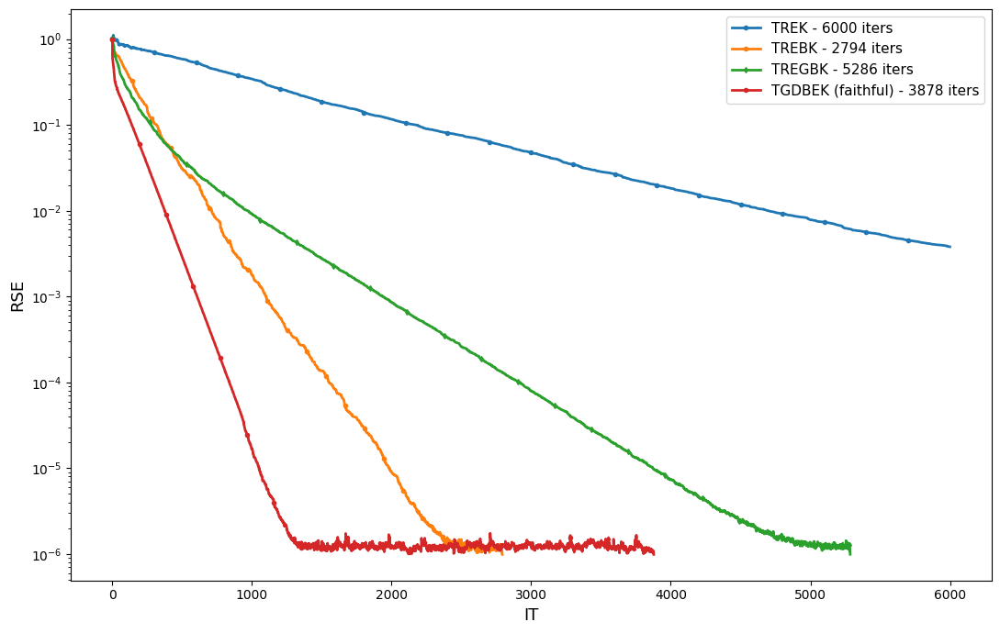
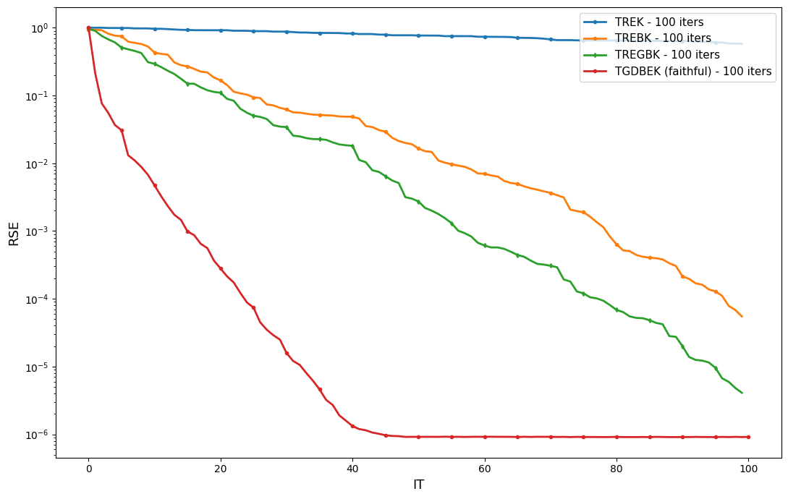
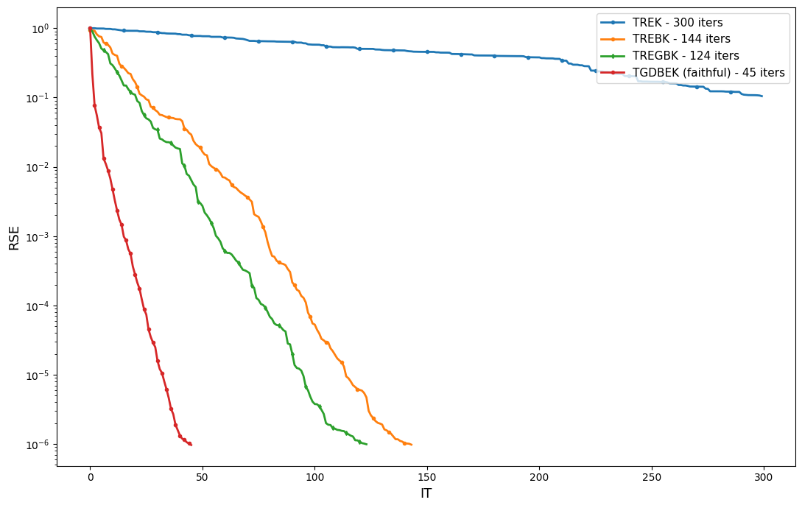

# Tensor greedy double extended Kaczmarz (TGDEK) Method

This repository contains the implementation of the Tensor greedy double extended Kaczmarz (TGDEK) method for solving large-scale linear  tensor equations under the t-product. 

The TGDBEK method is an efficient deterministic extended Kaczmarz variant to solve large-scale linear tensor equations. 

The TGDBEK method uses the greedy idea which selects the most "informative" hyperplanes to project onto at each iteration, leading to faster convergence compared to random selection methods.

We benchmark the TGDEK method against several state-of-the-art algorithms on synthetic and real-world datasets, demonstrating its superior performance in terms of convergence speed and accuracy.

We also apply the TDGBEK method to practical applicatons sucg as (color) image reconstruction and more. Finally, we assess the performance of the TDGEK method on sparse matrix from the [SuiteSparse Matrix Collection.](https://sparse.tamu.edu/).

The technical report detailing the convergence guarantees  will be made available soon.

#### The TDGEK Algorithm
<!-- [tgdbek_algorithm.jpg](./imgs/tgdbek_algorithm.jpg) -->
<p align="center">
  
</p>


## Some  comparison results of TGDEK with other methods on the Sparse SuiteSparse Matrices
Here are some results comapring the TGDEK method with other state-of-the-art methods on several sparse matrices from the SuiteSparse Matrix Collection. The results demonstrate the superior convergence speed and accuracy of the TGDEK method.

1. Matrix : `Cities`
   - Size: 128 x 128

```markdown

| Method            | Time (s) | Final Relative Residual | Iterations |
|------------------|---------:|------------------------:|-----------:|
| TREK             | 4.089088 | 3.804198e-03            |       6000 |
| TREBK            | 3.318066 | 9.868069e-07            |       2794 |
| TREGBK           | 6.943460 | 9.898250e-07            |       5286 |
| TGDBEK           | 5.953901 | 9.860950e-07            |       3878 |
```

Convergence plot for the `Cities` matrix:  RSE vs IT
<p align="center">
  
</p>

2. Matrix: `ash85`
   - Size: 85 x 85
   - nnz=523, density=0.072388

```markdown

| Method            | Time (s)  | Final Relative Residual |Iterations |
|------------------|----------:|------------------------:|-----------:|
| TREK             | 0.370058  | 2.013769e-02            | 500        |
| TREBK            | 0.368943  | 9.168464e-07            | 174        |
| TREGBK           | 0.574230  | 9.861334e-07            | 258        |
| TGDBEK           | 0.248358  | 9.275624e-07            | 78         |

```


Convergence plot for the `Cities` matrix:  RSE vs IT
<p align="center">
  
</p>

3. Matrix : `nos5`
   - Size: 153 x 153
   - nnz=1105, density=0.047190

```markdown
| Method             | Time (s) | Final Relative Residual | Iterations |
|-------------------|---------:|------------------------:|-----------:|
| TREK              | 0.454284 | 1.046636e-01            |        300 |
| TREBK             | 0.860288 | 9.801473e-07            |        144 |
| TREGBK            | 0.864311 | 9.928182e-07            |        124 |
| TGDBEK _f (good)  | 0.580567 | 9.692078e-07            |         45 |
```

Here's the convergence plot displaying  RSE vs IT:

<p align="center">
  
</p>


#### Dependencies
The code presented here largely depends on the following  repos:
-  [https://github.com/jnlandu/tensor-randomized-kaczmarz-algorithms](https://github.com/jnlandu/tensor-randomized-kaczmarz-algorithms), which contains the implementation of several randomized Kaczmarz algorithms for tensor equations.
- [https://github.com/jnlandu/tensor-tensor-toolbox-in-python](https://github.com/jnlandu/tensor-tensor-toolbox-in-python), which provides a python implementation of the t-product and other t-product based concepts, following the [tensor-tensor toolbox](https://github.com/canyilu/Tensor-tensor-product-toolbox) in MATLAB.


#### Citation
Coming soon.

### References
<!-- - Guang-Xin Huang, Shuang-You Zhong. Tensor randomized extended Kaczmarz methods for large
inconsistent tensor linear equations with t-product. Numerical Algorithms (2024) 96:1755–1778
https://doi.org/10.1007/s11075-023-01684-w -->


