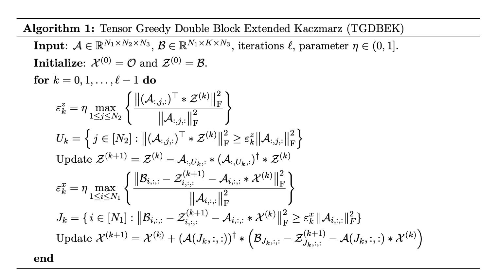
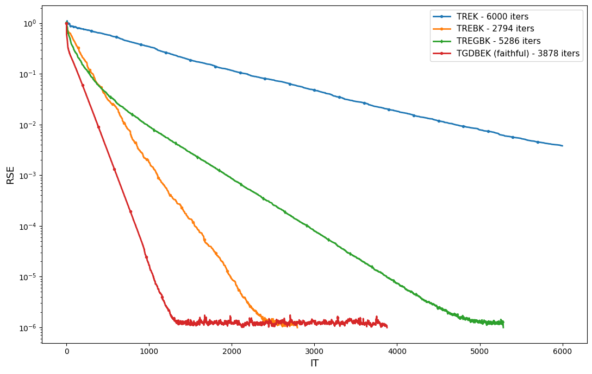
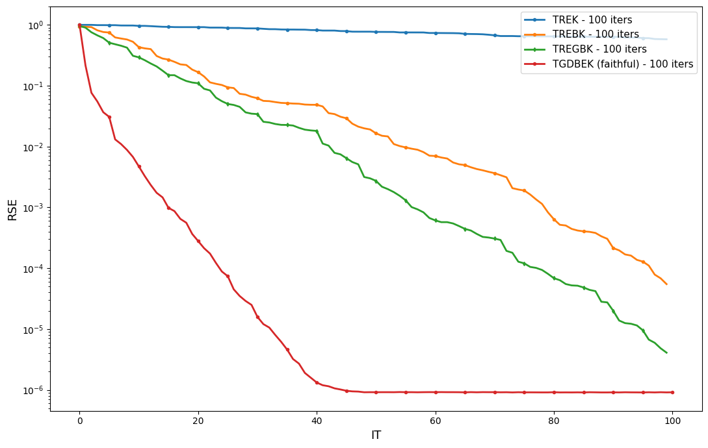
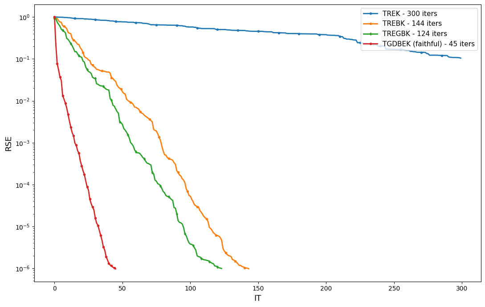

# Tensor Greedy Double Block Extended Kaczmarz (TGDBEK) Method

This repository contains the implementation of the Tensor Greedy Double Block Extended Kaczmarz (TGDBEK) method for solving large-scale linear tensor equations under the t-product, together with the code to reproduce all numerical experiments in the paper.

The TGDBEK method is an efficient deterministic extended Kaczmarz variant. It uses a greedy criterion to select the most "informative" hyperplanes to project onto at each iteration, leading to faster convergence than random selection methods.

We benchmark TGDBEK against several state-of-the-art algorithms (TREK, TREBK, TREGBK) on synthetic tensors, sparse matrices from the [SuiteSparse Matrix Collection](https://sparse.tamu.edu/), and (color and grayscale) image deblurring tasks. Performance is measured by running time (CPU), iteration count (IT), and relative residual/error; for image reconstruction we additionally report SSIM (Structural Similarity Index Measure) and PSNR (Peak Signal-to-Noise Ratio).

### Abstract

The randomized Kaczmarz method is a widely adopted iterative method for solving linear systems of equations. To solve large-scale inconsistent linear systems of tensor equations under the t-product, we propose a tensor greedy double block extended Kaczmarz (TGDBEK) method. We prove theoretically the convergence guarantees and show that the proposed method converges linearly to the minimum-norm least-squares solution of the tensor system. Moreover, we assess the performance of the proposed method through several numerical experiments. Compared to existing methods, TGDBEK does not require predefined partitions of the tensor system and reduces the running time for solving large inconsistent systems, while also requiring fewer iterations.

**The (peer-reviewed) technical report detailing the convergence guarantees will be made available soon. Find [here](./preprint.pdf) the first version of the report.**

#### The TGDBEK Algorithm

<p align="center">
  
</p>

## Repository structure

```
tgdbek/                      Core implementation of the TGDBEK algorithm
experiments/
  run_all_experiments.py     Orchestrator for all numerical experiments
  ex1_dense.py               Example 4.1 — dense overdetermined tensor systems
  ex2_sparse.py              Example 4.2 — sparse systems (SuiteSparse matrices)
  ex3_color_image.py         Example 4.3 — color image deblurring (flower.jpg)
  ex5_gray_image.py          Example 4.5 — grayscale (MRI-like) deblurring, Shepp–Logan
  ex6_eta.py                 Example 4.6 — effect of the greedy threshold eta
  generate_tables_pdf.py     Rebuilds experiments/tables/tables.pdf from run results
  utils.py                   Shared setup (paths, device, seed, plotting helpers)
  data/suitesparse/          Bundled SuiteSparse test matrices (.mtx)
  figures/                   Generated figures
  tables/                    Generated LaTeX tables and tables.pdf
requirements.txt             Python dependencies
```

## Installation

Requires Python ≥ 3.10 (tested with 3.13). From the repository root:

```bash
git clone https://github.com/jnlandu/tensor-greedy-double-extended-kaczmarz.git
cd tensor-greedy-double-extended-kaczmarz

python3 -m venv .venv
source .venv/bin/activate
pip install -r requirements.txt
```

`requirements.txt` installs the standard scientific stack (PyTorch, NumPy, SciPy, Matplotlib, scikit-image, imageio, ssgetpy) plus two companion packages from GitHub:

- [`tensor_toolbox`](https://github.com/jnlandu/tensor-tensor-toolbox-in-python) — a Python implementation of the t-product and related concepts, following the MATLAB [tensor-tensor product toolbox](https://github.com/canyilu/Tensor-tensor-product-toolbox);
- [`trk_algorithms`](https://github.com/jnlandu/tensor-randomized-kaczmarz-algorithms) — the baseline tensor randomized Kaczmarz algorithms (TREK, TREBK, TREGBK).

## Reproducing the experiments

All experiments are run from the `experiments/` directory:

```bash
cd experiments

python run_all_experiments.py               # run all examples
python run_all_experiments.py --example 2   # run a single example (1, 2, 3, 5, or 6)
python run_all_experiments.py --skip-images # skip the image deblurring examples
```

Each example can also be run standalone (e.g. `python ex1_dense.py`). The mapping to the paper is:

| Script | Paper example | Description |
|---|---|---|
| `ex1_dense.py` | 4.1 | Dense overdetermined systems, A ∈ R^{500×n×10}, n ∈ {20,…,80}, 5 trials |
| `ex2_sparse.py` | 4.2 | Sparse systems from SuiteSparse: `nos5`, `ash85`, `Cities`, `WorldCities`, `gre_216a` |
| `ex3_color_image.py` | 4.3 | Color image deblurring, 200×200×3, Gaussian blur σ=4 |
| `ex5_gray_image.py` | 4.5 | Grayscale (MRI-like) deblurring, Shepp–Logan 128×128×27 |
| `ex6_eta.py` | 4.6 | Sensitivity to the greedy threshold η ∈ {0.1, …, 1.0} |

Outputs:

- **Figures** are written to `experiments/figures/`.
- **Tables**: after a run, `python generate_tables_pdf.py` rebuilds `experiments/tables/tables.pdf` (requires a LaTeX installation providing `pdflatex`).

### Data

The SuiteSparse matrices used in Example 4.2 are bundled in `experiments/data/suitesparse/`; any missing matrix is downloaded automatically via `ssgetpy`. The test images (e.g. `flower.jpg`) ship with the repository in `references/imgs/`, and the Shepp–Logan phantom is generated by scikit-image.

### Reproducibility notes

- All experiments use a fixed random seed (`SEED = 1234` in `experiments/utils.py`), so iteration counts, residuals, and figures are deterministic on a given machine.
- The compute device is auto-selected in `experiments/utils.py` (Apple MPS → CUDA → CPU, in that order), with `float32` precision. Reported CPU times depend on your hardware and the selected device, so absolute timings will differ from the paper; iteration counts and residuals should match.

## Sample results on SuiteSparse matrices

Some results comparing TGDBEK with the state-of-the-art baselines on sparse matrices from the SuiteSparse Matrix Collection, demonstrating its superior convergence speed and accuracy.

1. Matrix: `Cities`
   - Size: 128 × 128

| Method | Time (s) | Final Relative Residual | Iterations |
|--------|---------:|------------------------:|-----------:|
| TREK   | 4.089088 | 3.804198e-03            |       6000 |
| TREBK  | 3.318066 | 9.868069e-07            |       2794 |
| TREGBK | 6.943460 | 9.898250e-07            |       5286 |
| TGDBEK | 5.953901 | 9.860950e-07            |       3878 |

Convergence plot for the `Cities` matrix (RSE vs IT):
<p align="center">
  
</p>

2. Matrix: `ash85`
   - Size: 85 × 85, nnz = 523, density = 0.072388

| Method | Time (s) | Final Relative Residual | Iterations |
|--------|---------:|------------------------:|-----------:|
| TREK   | 0.370058 | 2.013769e-02            |        500 |
| TREBK  | 0.368943 | 9.168464e-07            |        174 |
| TREGBK | 0.574230 | 9.861334e-07            |        258 |
| TGDBEK | 0.248358 | 9.275624e-07            |         78 |

Convergence plot for the `ash85` matrix (RSE vs IT):
<p align="center">
  
</p>

3. Matrix: `nos5`
   - Size: 153 × 153, nnz = 1105, density = 0.047190

| Method | Time (s) | Final Relative Residual | Iterations |
|--------|---------:|------------------------:|-----------:|
| TREK   | 0.454284 | 1.046636e-01            |        300 |
| TREBK  | 0.860288 | 9.801473e-07            |        144 |
| TREGBK | 0.864311 | 9.928182e-07            |        124 |
| TGDBEK | 0.580567 | 9.692078e-07            |         45 |

Convergence plot for the `nos5` matrix (RSE vs IT):
<p align="center">
  
</p>
